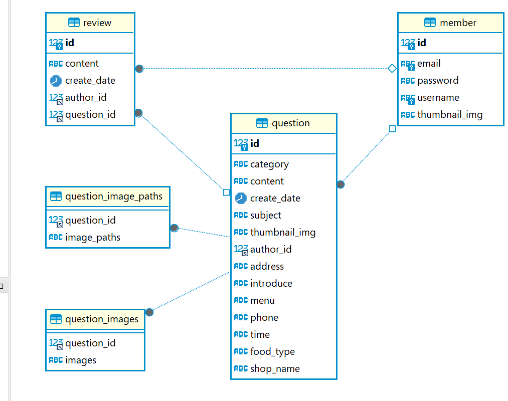

# Deli Home ReadMe

## 기획
평상시 어떤 음식을 먹을까 어디가서 먹어야 후회가 없을까 하는 고민에
자신과 같은 고민을 가지고 있는 사람들에게 그러한 고민 없이 남들이
추천해주는 맛집을 보고 참고해서 그러한 고민을 해결하고자 만들었습니다.

## 레퍼런스
- 식신(대한민국 NO.1 맛집 서비스)
- Tripadvisor
- 다이닝코드

## 데이터베이스

## 기능

### 회원기능
- 로그인
- 회원가입
- 아이디, 비밀번호 찾기
- 프로필
- 개인정보수정

### 게시글 리스트 기능
- 카테고리
- 검색기능
- 가게 등록 기능

### 게시글 상세페이지 기능

- 수정, 삭제 기능
- 추천 기능
- 리뷰 기능
- 별점 기능
- 리뷰 수정 ,삭제 기능
- 별점 수정 기능

## 🔥 트러블 슈팅

### 🚨 Issue 1
### 🚧 다중 이미지와 썸네일

- 🚥 본래 스크립트를 이용해서 다중이미지와 단일썸네일을 따로 구현하려고 했습니다.
  하지만 두개로 나눠서 구현하는 것보다 현재 실력에서 할 수 있는 방향으로는 차라리 단일썸네일을 포기하고 다중이미지 기능을 이용하는 것이 시간적으로 이득이라 생각하여 방향을 바꾸게 되었습니다.

